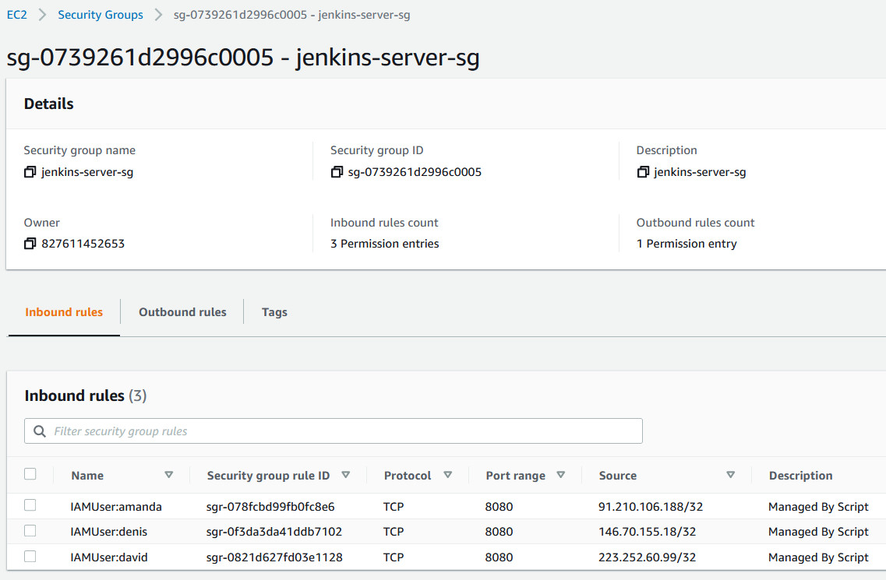

# Update EC2 SecurityGroup to your Pubic IP address

If your Public IP frequently changes and you need to keep your SecurityGroup
open ONLY to your Public IP, just execute this script again, it will update
SecurityGroup Rule with a new Public IP. Can be used by multiply IAM users.

For example Developer need access to Jenkins Server and his Public IP always changes.

### Update Script with the following:
```
SG_AWS_REGION="us-west-2"                  # Region where  SecurityGroup exist
SG_AWS_ACCOUNT_ID="827611452653"           # Account where SecurityGroup exist
SG_ID_TO_UPDATE="sg-0739261d2996c0005"     # SecurityGroup ID to Update
SG_FR_PORT=8080                            # Open SecurityGriup FROM port number
SG_TO_PORT=8080                            # Open SecurityGriup TO   port number
```
<br>This is how SecurityGroup rules Managed by Script looks like:<br>


## Copyleft (c) by Denis Astahov ADV-IT
